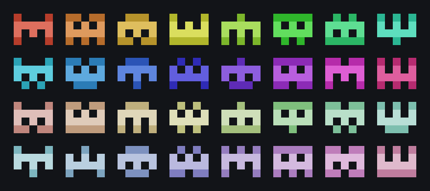
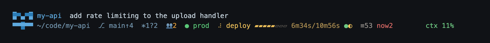
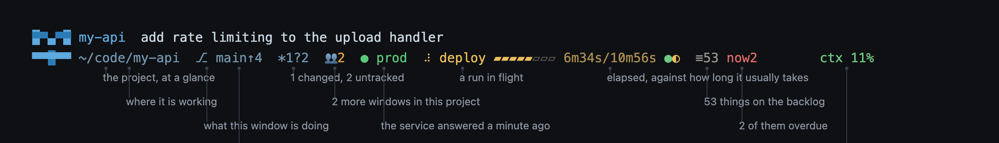

# claude-bestiary

A status line for Claude Code. Every project gets a small coloured creature, and you learn which
window you are in the way you learn a face — before you have read anything.



That is the whole palette, not a sample: 16 hues x 2 tones, and a project's creature is generated
from its path the first time it is seen and then never changes. Draw your own over it whenever
you would rather have the real logo.



Local Python, no dependencies, about 55ms per redraw. Everything on that line is something you
would otherwise have had to go and look up:



Both pictures are screenshots of a real run — `tools/render-statusline.py` builds a temporary
project, a deploy in flight and a healthy service, runs `statusline.py` against them, and
photographs the output. The labels are positioned by measuring where each segment actually landed,
so a segment that moves takes its label with it, and one that disappears fails the render instead
of leaving a line pointing at nothing.

## Install

```bash
git clone https://github.com/sainteye/claude-bestiary
cd claude-bestiary
./install.sh          # symlinks into ~/.claude, idempotent
./verify.sh           # checks the links are still links, and that it runs
```

Then in `~/.claude/settings.json`:

```json
{ "statusLine": { "type": "command",
                  "command": "bash ~/.claude/statusline-command.sh",
                  "refreshInterval": 2 } }
```

`refreshInterval` is not optional. Without it the status line only redraws on an event — measured
at 0.5 times a second on average, with gaps up to 6.4 seconds — and a deploy's progress bar and
elapsed time sit still, which looks exactly like a hang.

## What is on the line

| | |
|---|---|
| creature + name | which project, recognised before reading |
| the second line's title | what this window is doing — Claude Code's own session name, or the first thing you said |
| `⎇ main↑4` | branch, and how much is committed and not pushed |
| `+2*3?1!0` | staged, changed, untracked, conflicted — **counts, not just presence** |
| `👥2` | other Claude Code windows alive in the same project |
| `⠴ deploy ▰▰▰▰▱▱▱▱` | a run in flight, against how long that workflow usually takes |
| `● prod` | a live service, and how recently that was confirmed |
| `≡53 now2` | a backlog, and how much of it is overdue |
| `ctx · $ · 5h · 7d · project%` | context, cost, both quota windows, and this project's share of them |

Most of those are Cmd-clickable: the branch opens GitHub Desktop, the deploy opens the run, the
health light opens the site or its health endpoint depending on which one you actually want right
then, and the quota opens the usage page.

## Your registry is yours

`~/.claude/project-icons.json` holds every project's icon, colour and settings — keyed by
absolute path, often with the health endpoints of things you run. **It is not in this
repository**, `install.sh` will not overwrite one that exists, and if there is none it copies
[`project-icons.example.json`](project-icons.example.json) in for you to edit.

Keeping it in a private repository of your own and symlinking it in works fine, and that is what
the note about `os.replace` below is about.

## The files

| | |
|---|---|
| `statusline.py` | all of the drawing |
| `statusline-command.sh` | the entry point: finds python3, and prints in red when it breaks (never blank — blank looks like "not configured") |
| `project-icon.py` | `find` / `show` / `set` / `list` |
| `gh-run-status.py` | polls GitHub Actions in the background, writes `~/.claude/statusline-cache/` |
| `health-check.py` | probes a service in the background, same arrangement |
| `backlog-status.py` | reads a repository's backlog summary, same arrangement |
| `usage-report.py` | monthly token usage, summed from local transcripts |
| `skills/project-icon/` | the procedure for "draw this project an icon" |
| `tools/render-bestiary.py` | draws the wall of creatures, from the code that draws the real ones |
| `tools/render-statusline.py` | screenshots the status line and the labelled version of it |

## Why a separate repository and symlinks, rather than `git init ~/.claude`

`~/.claude` holds your transcripts — every prompt you have typed, snapshots of every file you
have edited, and whatever was in the files you asked about. On this machine that is 2.8 GB.

A `.gitignore` blocklist is **guaranteed to fail eventually**: Claude Code grows new state
directories on its own schedule — `paste-cache`, `image-cache`, `file-history`, `tasks` and
`plans` all appeared later — and a blocklist's default for a new directory is **include it**.
This repository is not under `~/.claude`, so "something leaked in" is not a thing that has to be
prevented here, it is a thing that cannot happen.

**Resolve the symlink before writing.** `os.replace()` replaces the path, not the file the path
points at, so an atomic write to `~/.claude/project-icons.json` turns that symlink into a real
file — after which the version in your repository is no longer the one running, and **neither
side reports an error**. It happened for real on 2026-08-11, triggered by auto-registering a new
project, and `./verify.sh` is what caught it.

**A skill's directory cannot be a symlink.** Measured 2026-08-11: Claude Code skipped the
symlinked directory while scanning `skills/`, and listed the physical backup directory next to it
as a skill instead. So `install.sh` keeps the directory real and links only `SKILL.md`.

## Service health: a light that is alive

Add `health` under a project in the registry:

```json
"health": {
  "url": "https://example.com/health",
  "label": "prod",
  "expect": {"status": "ok", "database": true, "worker": true}
}
```

| shown | means |
|---|---|
| `● prod` bright green | confirmed within three minutes, every `expect` key matched |
| `● prod` dim green | still fine, but the probe has been quiet for a while |
| `⚠ prod ?25m00s` yellow | **the probe stopped, so nobody knows** — which is not "fine" |
| `✗ prod database=false` red | broken, and it says which key |
| `⚠ prod ?(offline)` grey | it is your network, not production |

**A green light is alive, not painted on.** A tick that is always there looks exactly like a probe
that stopped weeks ago, so this light encodes both "is it well" and "how recent is that
judgement" — past ten minutes without an update it stops being bright green.

Telling "broken" apart from "your wifi is down" costs one extra request to `1.1.1.1`, **only on
failure**. Something else answers, so it is the service; nothing answers, so it is you. The normal
path never pays for it.

The rule for choosing `expect` keys is **pick the one whose failure has no symptom**. A login
throttle that cannot read the client's IP fails silently and completely, with the door open and
nothing to see. A scheduler that has stalled leaves the site up and every page loading, and
nothing syncing. Those are the keys worth watching; "is the web server up" you would have found
out anyway.

**Types have to match.** One service returns `"ok"` and another returns `true` for the same idea,
and the comparison is strict equality — so `curl` it once before configuring rather than guessing.
Guessing the path, too: a wrong one returns your framework's 404 page and gives you a
configuration that is permanently red.

**A check with no threshold does not get one made up.** If a service reports counts you do not
know the normal value of, leave them out. **Inventing a threshold produces false alarms, and
false alarms train you to ignore the light.**

## Monthly usage: tokens are countable, money is not

```bash
python3 usage-report.py                    # this month, every project
python3 usage-report.py --project my-api
python3 usage-report.py --months           # one line per month
python3 usage-report.py --cache            # the small file the status line reads
```

The **`project 45.1%`** cell is one column of this report: what share of this month's total tokens
this project has taken. It sits directly after `7d` on purpose — `7d 95%` says how much is left,
this says **who spent it**, and you need both to decide anything.

**It deliberately prints no money.** On 2026-08-12, working backwards from the official
`total_cost_usd` of eight then-running sessions to a unit price for one model gave **$0.45 to
$25.25 per MTok — a factor of 55**:

| session | equivalent usage | official cost | implied unit price |
|---|---|---|---|
| A (never compacted) | 1.41 MTok | $7.20 | $5.11 |
| B | 5.30 | $28.29 | $5.34 |
| C (compacted 4 times) | 99.97 | $1,480.86 | $14.81 |
| D (just compacted) | 11.39 | $5.17 | $0.45 |

At least three reasons it cannot be recovered: `total_cost_usd` **is reset to zero by `/compact`**
(one session read $32.61 before and $5.07 after, with both halves still in the transcript),
requests over 200k of context are priced separately, and server-side tools like web search are
not tokens at all.

**A made-up unit price produces a number that looks precise and can be wrong by 55x, which is
worse than no number — without one you go and look it up, with one you do not.**

**A project is decided once per session, not per record from `cwd`.** After an agent `cd`s into
`backend/`, every later record's `cwd` is a subdirectory, and deciding per record invents
`backend` / `frontend` / `terraform` as projects. The first version did that, and `backend`
reached the top of the table.

## A few design notes

**An icon is 4 rows by 5–8 columns.** The status line is two lines of text, and `▀` / `▄` paint
the top and bottom halves of a cell separately, so one line of text holds two rows of pixels.

**The status line never touches the network.** Deploy, health and usage all read a cache file, and
a stale one spawns a detached process to refresh it. The cache format has nothing to do with
GitHub: anything that writes `{state, label, started_at, typical_seconds, steps}` gets drawn.

**A progress bar rather than a spinner.** It is based on the median of that workflow's recent real
runs, so it reads correctly however slow the redraws are. The spinner is incidental.

**The backlog cell recounts on the source file's mtime, not on a timer.** It reads one local file,
so polling only buys you a change you saved ten minutes ago still not being on screen.

**Four columns are always left free on the right** (`options.right_reserve`). The documentation
says system notifications share the right of that same line and will truncate your output in a
narrow terminal — `COLUMNS` is the width of the terminal, not the width you have.

**Nothing is ever cut in half.** When the line does not fit, whole segments are dropped in order
of what changes a decision least. Half a percentage is worse than no percentage.

## Drawing your own icon

```bash
python3 ~/.claude/project-icon.py find     # logo files in this repository
python3 ~/.claude/project-icon.py show     # what is drawn now, enlarged and at real size
echo '{"bg": "#2F6B5E", "palette": {"W": "#EEF6F4"},
       "rows": [".WWWWW.", ".W...W.", ".W.W.W.", ".W...W."]}' \
  | python3 ~/.claude/project-icon.py set
python3 ~/.claude/project-icon.py list     # everything, to check for colour collisions
```

Four rows, 5 to 8 columns, all the same width. The test is not "does it look like the logo", it is
**"shrunk to that size and glanced at, could it be confused with the others"**. There is a skill
for it: ask Claude Code to draw one and it will find the logo, look at it, and write the entry.

## Also

[Clawdline](https://github.com/sainteye/clawdline) is a prompt bar for Claude Code that reads the
same registry, so the icon in your terminal and the icon in the bar are the same icon — because
they are the same row, not because two programs were kept in step by hand. Its
[docs/project-status.md](https://github.com/sainteye/clawdline/blob/main/docs/project-status.md)
documents the cache-file formats, so anything can produce them.

## Licence

MIT.
